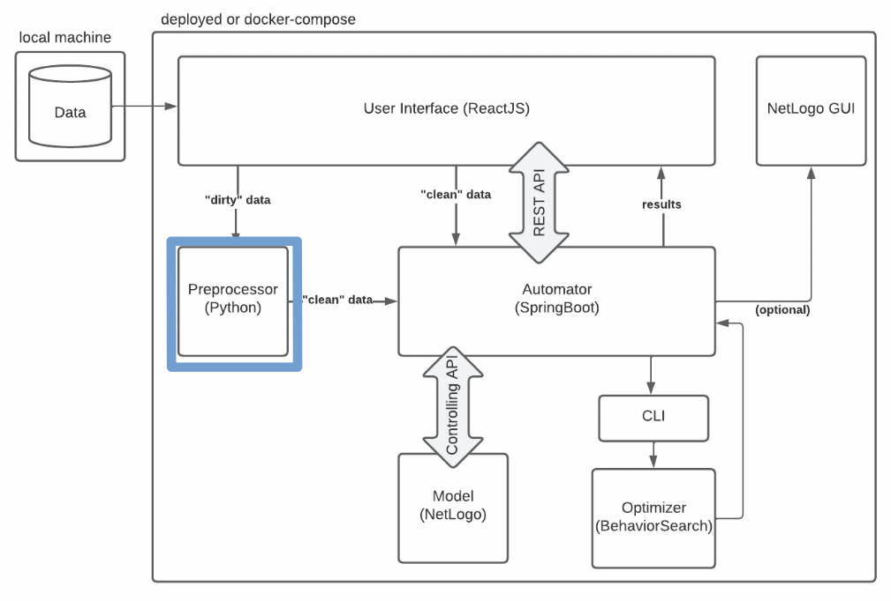

# data-processing
This python file will take a csv file containing survey results in a specific format. The survey results are then processed to yield useable data for the netlogo model. The results of the processing will be passed into another csv file which can then be read by the *automator* who uses the *Controlling API* to submit the data to the netlogo model.

